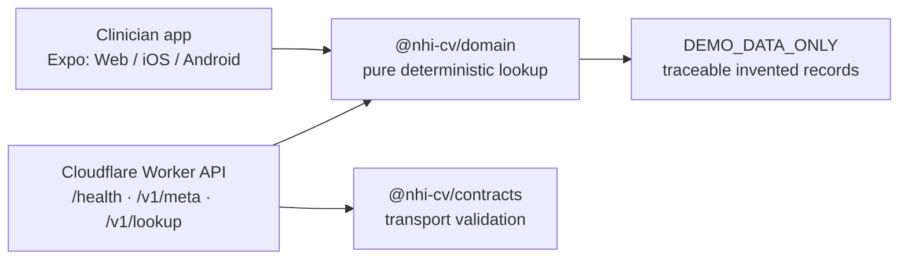

# NHI CV Drug Rule Locator — Phase 0

> **DEMO_DATA_ONLY — 示範資料，非健保署核定資料／不可作為申報依據。**

這是一個醫師診間快速查詢系統的基礎版本。單一 Expo 應用程式支援 Web、iOS、Android，並共用 deterministic 藥品查詢核心。它只查詢藥品資料；不收集、傳送或保存病人姓名、病歷號、檢驗值、診斷或其他病人資料，也不會輸出任何病人「符合／不符合給付」結論。

## 現在可以做什麼

- 以健保藥品代碼、商品名、學名或成分搜尋**虛構示範資料**。
- 以 NFKC、去首尾空白、英文字大寫、移除空白和連字號正規化 10 碼藥碼；只做精確比對，絕不自動校正一碼之差。
- 多筆候選永不自動選第一筆；資料日期或版本無法驗證時 fail closed。
- 查詢資料的版本、日期、價格資料狀態與人工覆核需求可追溯。

## 不可使用於

- 健保申報、支付價確認、給付資格判定或臨床決策。
- 正式法規或官方支付價查詢。原始 Master Project Prompt v3.2 及官方／RA 核定資料尚未進入此工作區，詳見 [docs/spec-source-status.md](docs/spec-source-status.md)。

## 本機啟動

```bash
pnpm install
pnpm typecheck
pnpm test
pnpm --filter @nhi-cv/clinician start:web
```

產生 Web 靜態匯出：

```bash
pnpm export:web
```

Worker 的檢查（不部署）：

```bash
pnpm worker:types
pnpm worker:dry-run
```

## 架構



## 目錄

- `apps/clinician`：mobile-first Expo 介面，搜尋欄為開啟後的第一焦點。
- `apps/api`：Cloudflare Worker；只提供 health、metadata、lookup，且不部署。
- `packages/domain`：無 I/O、無病人模型的 deterministic 查詢與示範資料。
- `packages/contracts`：API 輸入驗證與錯誤合約。
- `docs`：資料、隱私、法規、威脅模型、測試與 Phase 計畫。

## 平台限制

可於本機驗證 TypeScript、單元測試、Web 靜態匯出及 Worker dry-run。此環境沒有完整 Xcode，也沒有 Android `adb`，因此 iOS／Android 模擬器或實機啟動均為 **BLOCKED**，不能視為已驗證。

## 授權與貢獻

請先閱讀 [CONTRIBUTING.md](CONTRIBUTING.md)、[SECURITY.md](SECURITY.md) 與 [docs/regulatory-decision-log.md](docs/regulatory-decision-log.md)。禁止加入未核定規則、真實支付價、病人資料或硬編碼 secret。
