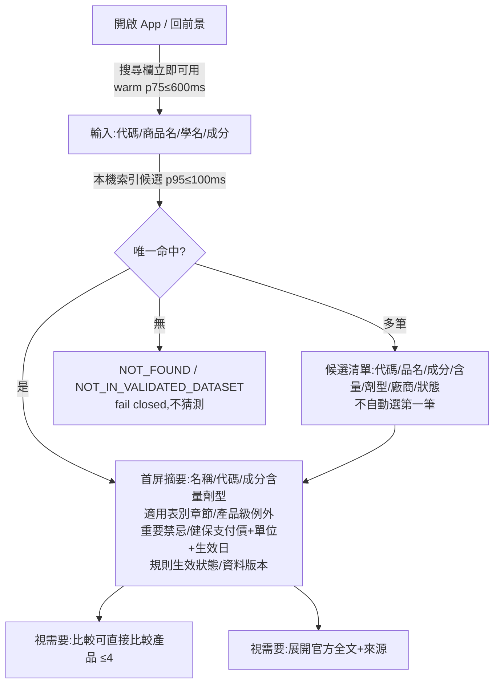

# 醫師看診後快速查詢流程圖(§30 #10)

依 v3.2 §2.5–§2.6、§20.6–§20.9。Human Factors 驗證(實機、實務情境)於 Phase 4/6 執行;本圖為設計基準。

## 1. 情境前提

醫師已在院內合法系統完成臨床判斷;本系統**零病人資料**,只回答「這顆藥的給付規則與健保支付價」。使用常被中斷(病人對話/電話),多為單手、短時、高頻。

## 2. 主路徑 A:Drug-first Quick Lookup

TTFCA 於 S→R 全程量測(docs/performance-budget.md)。

## 3. 次路徑 B:Rule-first Quick Browse

固定、經核准的法規標籤(表一/表二/2.6.2/2.6.3/statin intolerance/6–8 週/3 個月例外/gemfibrozil 限制)→ 回傳符合標籤之產品清單。**不得**要求病人資料、不得輸出「這位病人該用哪顆」、不得依價格推薦;入口醒目度低於主搜尋框,不得演變為問卷。

## 4. 中斷耐受要點(§20.9)

背景返回保留查詢文字與位置(非敏感);session 失效清楚提示並安全重登;主要操作單手可完成;loading 保留輸入。

## 5. 首頁禁止事項(§20.6)

搜尋前不得經過:新聞頁、行銷頁、dashboard 圖表、多層選單、非必要 modal、病人資料表單。

## 6. Human Factors 驗證計畫(Phase 4/6)

- 任務式測試案例採 v3.2 §22 清單(已知代碼查規則價格/只知商品名選規格/以 3 個月例外標籤瀏覽/比較同規格產品…)
- 場域:中階實機+診間網路模擬;量測 TTFCA 與 3 次互動內完成率(≥90%)
- 【待人工確認】受測醫師招募與 IRB/倫理需求(如適用)
