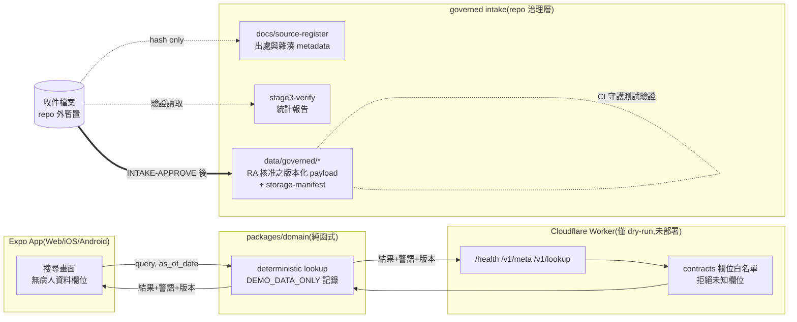

# Data Flow Diagram(§30 #29)

兩張圖:現況(Phase 0/0.5 + governed intake,已實作)與目標態(v3.2 §17 基準架構,實作 Phase 待建)。目標態各節點以【待人工確認】標注尚未經 ADR 定案者。

## 1. 現況資料流(已實作)



**關鍵隔離**:`data/governed/` 與 `source-intake` 均不被 domain/API/UI 引用(隔離測試鎖定);查詢核心只含 DEMO 資料。全系統無病人資料節點。

## 2. 目標態資料流(v3.2 §17 基準,實作 Phase 待建)

```mermaid
flowchart LR
  subgraph Clients["Web / iOS / Android / Admin"]
    C1[醫師客戶端\n本機版本化搜尋索引]
    C2[管理後台]
  end
  subgraph CF["Cloudflare"]
    W[Workers API]
    D1[(D1 關聯資料庫\n規則/藥品/價格/帳號)]
    R2[(R2\n官方原始文件)]
    KV[(KV/Cache\n非敏感快取)]
    TS[Turnstile]
  end
  C1 -->|query + as_of_date\n無病人資料| W
  C2 -->|管理操作 + MFA| W
  W --> D1
  W --> R2
  W --> KV
  C1 --> TS --> W
  GOVsrc[governed 資料\n(intake runbook 產出)] ==發布版本==> D1
  GOVsrc ==原始文件==> R2
```

- 【待人工確認】D1 適用性與 primary location(Data Residency ADR,tracker #6)
- 【待人工確認】R2 bucket location 與 log 儲存地區(同上)
- 【待人工確認】跨平台客戶端方案(Mobile ADR,tracker #8)
- 個資節點(帳號/醫師資格)僅存在於目標態之 Phase 2+;其資料流圖於該 Phase 設計時擴充,並遵守 v3.2 §15/§16/§18(不入 URL/log/analytics/cache)

## 3. 禁止的資料流(兩張圖皆適用)

- 病人資料:任何節點、任何方向,一律不存在
- 官方規則/價格 payload:唯一入口是 governed intake(runbook Stage 1–5);不得直接進 domain/API/UI/測試
- 憑證與 secret:不入 repo、不入客戶端 binary、不入 log
